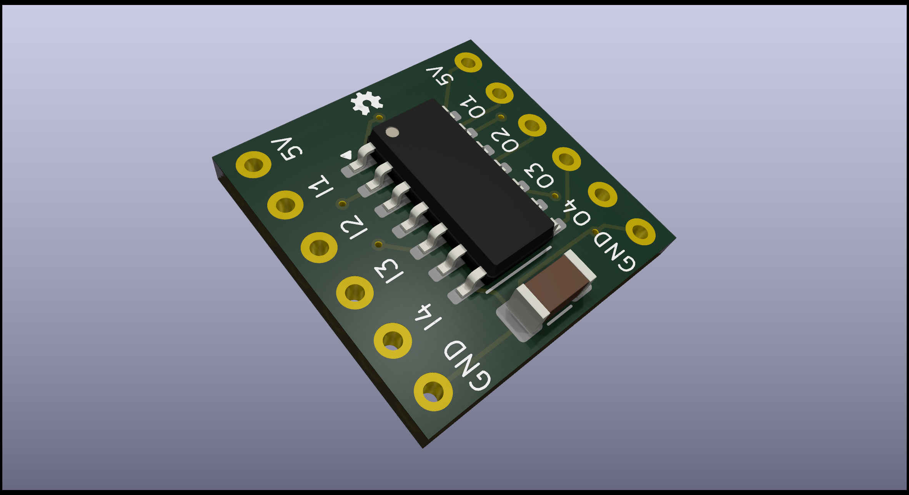

# SN74AHCT125 shifter breakout PCB

This project describes a breakout board for the 74AHCT125 Quad Buffer/Line Driver IC, used as a level shifter. The 74AHCT125 can shift signals from a lower voltage level, such as 3.3V, to a higher level, such as 5V. This is particularly useful when connecting microcontrollers with different voltage levels.
It's intended use is to shift the LED data line from an ESP to drive digital LEDs like the WS2812b, but it can be used for a lot of different usecases.

## Overview

The 74AHCT125 consists of four independent buffer/line driver units with three-state outputs and active-low enable (OE) inputs. The OE inputs allow each of the four channels to be controlled individually. The chip operates with a supply voltage of 4.5 to 5.5V and can shift signals to a 5V level when powered at 5V.

This breakout board provides an easy way to use the 74AHCT125 in level-shifting applications. With its modular design, the board can be used for both single-channel and multi-channel applications.

## Features

- **IC**: 74AHCT125 Quad Buffer/Line Driver with three-state outputs
- **Voltage Level**: Converts 3.3V signals to 5V
- **Four Independent Channels**: Each channel can be enabled separately
- **Simple Breakout Design**: Access to all pins of the IC
- **Operating Voltage**: 4.5V to 5.5V (typically 5V)
  

## Pinout

| IC Pin | Description                  |
|--------|------------------------------|
| VCC    | Supply voltage (5V)          |
| GND    | Ground                       |
| I1-I4  | Inputs of channels 1 to 4    |
| O1-O4  | Outputs of channels 1 to 4   |

## Usage Example

1. Connect the VCC pin to 5V and the GND pin to ground.
2. Connect a data output from a microcontroller to the A input of any channel.
3. The corresponding Y output will provide a 5V data signal, which can be safely used with 5V logic devices.
4. To enable a channel, set the corresponding solderjumpers on the bottom of the PCB.
## Notes

- The 74AHCT125 is designed for one-way level-shifting, typically from 3.3V to 5V. It is not suitable for bidirectional level-shifting.
- Ensure the OE pin for each active channel is set to low to enable the output.
- if a channel is unused, please disable that channel with the solder jumpers on the bottom.

## Schematic

An example schematic is included in the `schematics` folder.

## Production Files

All files needed for production (Gerber, BOM, CPL) are included in the `production` folder.

## Project Files

This project was developed in KICad. Those project files are in the `project` folder.

## License

This project is licensed under the CERN-OHL-S V2 License. For more information, see the `LICENSE` file in the root folder of the repository
