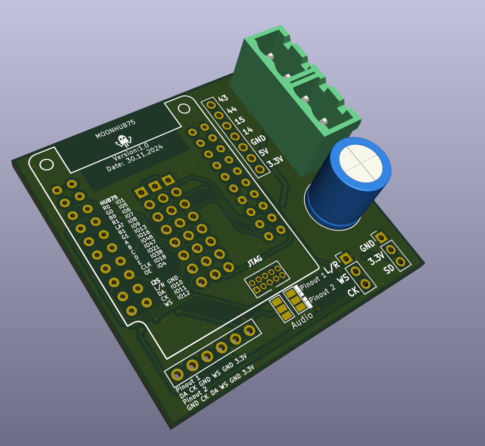

# MOONHUB75

This project is a passive adapter board to connect a [Lilygo T7-S3](https://lilygo.cc/products/t7-s3) to a HUB75 Panel. 

## Connections

### HUB75
It features two Methods to connect the HUB75 Panel
|Mode|Description|
|----|-----------|
|1|Female Sockets to directly Plug onto the Panel|
|2|Male Pins, to use a 16-Pin Ribbon Cable|

This is heavily inspired by the [ESP-HUB75-Driver by rorosaurus](https://github.com/rorosaurus/esp32-hub75-driver/). There are also pictures visible there.

|Hub75|GPIO|
|--|--|
|R0|IO1|
|G0|IO5|
|B0|IO6|
|R1|IO7|
|LAT|IO8|
|B1|IO9|
|G1|IO13|
|A|IO16|
|B|IO48|
|C|IO47|
|D|IO21|
|E|IO38|
|CLK|IO18|
|OE|IO4|

### Audio
The board has multiple Audio connections, that are mapped to the same Pins. 

There is a Connection to directly connect the INMP441 circle PCBs to it and there is a single row to either connect different boards. We noticed that there are two different pinouts so there are solder bridges to swap some pins around. L/R is connected to ground

|I2S|GPIO|
|--|--|
|DA|IO10|
|CK|IO11|
|WS|IO12|

### JTAG

For Debug purposes the JTAG connection of the ESP are compacted into one connector
The pinout is made to match the JTAG connector of the [ESP-Prog](https://docs.espressif.com/projects/esp-iot-solution/en/latest/hw-reference/ESP-Prog_guide.html). 

## Schematic

An example schematic is included in the `schematics` folder.

## Production Files

All files needed for production (Gerber, BOM, CPL) are included in the `production` folder.

## Project Files

This project was developed in KICad. Those project files are in the `project` folder.

## License

This project is licensed under the CERN-OHL-S V2 License. For more information, see the `LICENSE` file in the root folder of the repository
